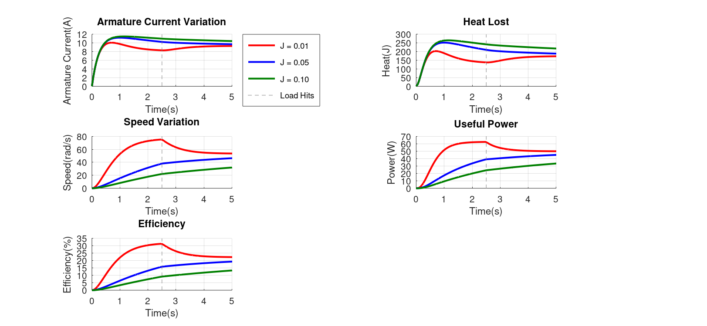
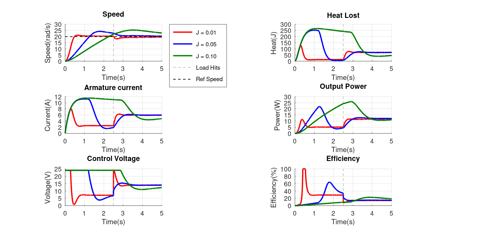

# DC Motor Simulation & PID Speed Control

## What is this about?
This project simulates the dynamic response of a DC motor under varying physical conditions using a custom-tuned PID controller. The simulation specifically explores how Rotational Inertia ($J$) and Load changes affect system stability, efficiency, and thermal performance.

## Why did I do all of this?
Motors are everywhere — fans, EVs, robots, conveyors. But just plugging in a motor and hoping for the best doesn't work in real applications. Effective control requires a clear alignment between the system requirements (load/speed) and the motor's physical capabilities (torque/voltage). This project helped me understand: 
* How inertia (J) affects how a motor accelerates and responds
* What happens when we suddenly load a motor
* The thermal and efficiency costs of these dynamic behaviors
* How the PID controller corrects the speed as per our requirement in real time

Built entirely in MATLAB/Octave for a self learning project. 

## Motor Model

The motor works primarily on these two equations:
* Electrical: $$L \frac{di_a}{dt} = V_a - R_a i_a - K_b \omega$$ and
* Mechanical: $$J \frac{d\omega}{dt} = K_t i_a - B \omega - T_L$$ 

Where:
- $V_a$ = Armature Voltage (control input)
- $i_a$ = Armature Current
- $\omega$ = Rotor Speed
- $K_b$ = Back-EMF Constant
- $K_t$ = Torque Constant
- $T_L$ = Load torque 
- $L$ = Armature Inductance
- $J$ = Rotor Inertia
- $B$ = Friction Coefficient

## What was simulated?

1. I simulated the dynamic response of the motor for varying Inertia($J$), with a load disturbance at t = 2.5s, and observing their effect on the heating loss, useful output power and efficiency of the motor.
2. I implemented a PID controller to achieve a target speed (20 rad/s), with a load disturbance at t = 2.5s, and observed the changes on the same parameters as above.

Both cases are compared side by side to show the impact of introducing PID control.

## Without PID Control

*Without control, each inertia value drifts to a different 
steady-state speed with no guarantee of reaching the target.*

## With PID Control  

*PID controller drives all three inertia cases to the 
target speed of 20 rad/s, despite load disturbance at t = 2.5s.*

## Key Observations

- At startup, efficiency is near zero for all cases — motor draws maximum current while speed (and thus useful power) is still building up

- Low inertia ($J=0.01$) causes speed overshoot and oscillation — the PID struggles because dynamics are too fast

- High inertia ($J=0.10$) responds sluggishly but settles smoothly — PID requires sustained high voltage

- Load disturbance at $t=2.5s$ causes immediate current spike as PID demands more torque to recover speed

- Heat loss is dominated by high-$J$ motor due to prolonged high current during acceleration

- Low $J$ (red) recovers efficiency fastest due to rapid  acceleration, while high $J$ spends a lot of time in the low efficiency zone.

- High $J$ requires sustained PID controlled voltage to reach desired speed, while low $J$ achieves the required speed quickly and even recovers quickly during load changes.

**Note**: To maintain physical consistency during high-speed transients, the efficiency ($\eta$) is clamped to a $[0, 100]\%$ range. This prevents "division-by-zero" errors that occur during sub-millisecond intervals where the PID controller modulates voltage near the zero-crossing.

## Tools

- MATLAB/Octave

 *This started from curiosity — and ended with truly understanding why a motor behaves the way it does.* 

